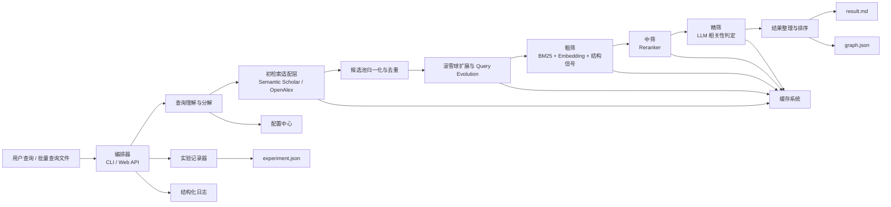

# 项目架构设计与分阶段开发规划书

## 0. 项目类型判断与设计前提

### 0.1 项目类型判断

本项目应判定为：**Python 智能论文搜索系统**，当前以 CLI 为主要交互入口，后续可扩展 Web 前端。

判断依据：

- 当前目标是输入自然语言学术查询，输出 `Markdown 论文列表 + graph.json`。
- 赛事未要求必须为 CLI 或必须为 Web 前端，交互形式以赛事说明为准；当前阶段优先 CLI 以保证开发效率和评测便利，但不排除后续增加 Web 前端。
- 环境约束为本地 `Python 3.10 + conda`，说明现阶段以本地开发、单机运行、竞赛提交为主。
- 结果交付以结构化文件产物为核心，而不是长期在线服务。

因此，本设计按”**编排器 + 外部学术 API + 本地缓存/日志/实验记录 + 结构化结果输出**”的工程模式设计，交互层（CLI / Web API）作为可替换入口，核心业务逻辑与交互形式解耦。

### 0.2 设计前提与关键约束

1. 竞赛评测权重为：F1 Score 70%、运行效率 20%、结果结构化 10%。
2. 当前阶段必须优先保证：**检索召回、成本控制、可复现实验、输出结构化**。
3. 不自建论文数据库，不做全文下载与解析，不做在线用户系统。
4. 至少接入一种学术检索 API，当前规划以 **Semantic Scholar + OpenAlex** 为主双源。
5. 配置、密钥、缓存、日志、实验记录、输出目录、统一 Paper 数据模型必须先于业务模块稳定下来。
6. 模型、阈值、Top-K、批大小、权重、最终部署方案均为**待评估参数**，不能在设计阶段写死为最终值。

### 0.3 开发顺序修正说明

虽然当前任务板中 `T-011` 已进入“最小闭环实现”表述，但从项目目标、目标边界、README 草案和 STEP 来看，真实顺序应为：

**基础设施与统一数据契约 → 参考系统研究与策略对齐 → 贯穿式评测基线与输出契约 → 查询理解 → 初检索 → 公共服务底座 → 滚雪球 → 粗筛 → 中筛 → 精筛 → 结果整理 → 回归调优**。

因此，本设计文档按上述顺序组织。后续实施时，建议将“最小闭环”拆成两个层次：

- 第一层闭环：骨架、契约、评测、输出规范闭环。
- 第二层闭环：查询理解、初检索、结果整理的业务闭环。

这样可以避免“先编码、后补契约”的返工风险。

## 1. 总体系统架构

### 1.1 总体目标

系统要把复杂自然语言学术查询转化为一条可复现、可评测、可扩展的论文搜索流水线，最终输出：

- `result.md`：面向评测与阅读的结构化论文列表
- `graph.json`：面向结构化展示的引文关系图数据
- `experiment.json`：面向对比实验与回归的运行记录
- `logs/`：面向排障和成本分析的结构化日志

### 1.2 总体逻辑架构图



### 1.3 运行拓扑图

```mermaid
flowchart TB
    subgraph LocalNode[本地单机运行节点]
        Entry[编排器\nCLI / Web API]
        Core[搜索编排器]
        Cache[.cache/]
        Outputs[outputs/{run_id}/]
        Logs[JSON Logs]
    end

    subgraph ExternalServices[外部依赖]
        S2[Semantic Scholar API]
        OA[OpenAlex API]
        LLM[LLM API]
        EMB[Embedding / Reranker\n本地或远程]
    end

    Entry --> Core
    Core --> S2
    Core --> OA
    Core --> LLM
    Core --> EMB
    Core <--> Cache
    Core --> Outputs
    Core --> Logs
```

### 1.4 架构设计原则

1. **先契约后算法**：先把输入输出、缓存键、日志字段、实验记录、Paper 模型稳定下来，再接业务模块。
2. **先召回后精排**：前段宽松召回，后段逐层收口，避免过早剪枝导致 F1 损失。
3. **把 venue 从硬过滤改为强排序信号**：因为 README 草案明确指出 venue 字段在不同 API 中不稳定，直接硬删会误伤召回。
4. **所有关键参数都可评测、可回放**：阈值、Top-K、模型、并发量、批大小必须进入 `config_snapshot`。
5. **本地优先、轻量持久化**：当前阶段不引入服务型数据库与消息队列，优先单机文件系统 + 轻量索引实现。
6. **安全默认开启**：API Key 不落盘到跟踪文件，不写入日志，不进入缓存键。

---

## 阶段一：基础设施与环境搭建

项目动工的第一步，所有后续开发的地基。

### 1. 部署与基础设施拓扑

#### 1.1 当前推荐部署形态

本项目当前阶段不应设计成常驻在线服务，而应设计成：

- **开发态**：本地 `conda` 环境下的 CLI 工具
- **评测态**：单机批处理任务
- **提交态**：可封装为单容器或单命令执行包
- **展示态**（可选）：通过 Web API（如 FastAPI）暴露服务，前端按需构建

原因：

- 当前没有用户系统，优先保证核心流水线质量。
- 评测重心是端到端查询处理能力，而不是高并发在线服务能力。
- 外部依赖主要是学术 API 和模型 API，主要瓶颈在请求编排与排序链路，而不是 HTTP 服务吞吐。
- 赛事未限制交互形式，当前阶段 CLI 最高效，但核心逻辑与交互层解耦，后续可低成本扩展 Web 前端。

#### 1.2 基础设施最小拓扑

- 1 个本地执行节点：运行搜索流水线
- 1 组本地缓存目录：保存 API 响应、引文、embedding、LLM 判定
- 1 组本地输出目录：保存结果、图数据、实验记录、日志
- N 个外部服务：Semantic Scholar、OpenAlex、LLM、Embedding/Reranker

#### 1.3 分发方式

建议分两层分发：

- **开发分发**：命令行方式直接运行
- **复现实验分发**：固定环境变量、固定配置快照、固定输入文件后的一次性任务运行

当前不需要：

- 域名
- CDN
- 网关
- 服务发现
- 负载均衡
- Kubernetes 集群

这些都不符合当前竞赛阶段的真实复杂度，但若后续增加 Web 前端，可按需引入网关和容器编排。

### 2. 全局底层技术栈

#### 2.1 语言与运行环境

- **主语言**：Python 3.10
- **环境隔离**：conda（已确认本地环境）
- **运行模式**：单进程编排 + I/O 并发请求

选择依据：

- 当前本地环境已经明确为 Python 3.10 + conda。
- 学术 API 调用、LLM 调用、文本处理、排序模型集成在 Python 生态中成本最低。
- 竞赛目标更依赖算法编排与实验复现，而不是多语言微服务拆分。

#### 2.2 核心基础库建议

只引入对当前目标有直接价值的库，避免概念堆砌：

- **Pydantic**：定义 QueryPlan、Paper、Candidate、JudgeResult、ExperimentRecord 等结构化契约
- **httpx**：统一封装外部 API 请求，支持超时、重试、并发
- **langchain**：LLM 调用封装、prompt 模板管理与结构化输出解析，用于查询理解与精筛模块
- **langgraph**：有状态多步 Agent 循环编排，用于滚雪球/Query Evolution 的迭代收敛控制
- **tenacity 或等价重试封装**：处理限流、瞬时失败、429/5xx 重试
- **rank-bm25**：粗筛阶段的稀疏检索基线
- **numpy**：向量相似度与打分融合
- **sentence-transformers 或等价抽象层**：Embedding / Reranker 适配本地或远程模型
- **标准 logging + JSON formatter**：输出结构化日志

其中：

- `Pydantic + httpx + logging` 为基础必选。
- `Embedding/Reranker` 的本地/远程实现形式先抽象接口，不在设计阶段锁死。

#### 2.3 代码托管与协作

- **代码托管**：Git 仓库
- **分支策略**：主分支保持可运行，策略实验走短期特性分支
- **提交原则**：每次提交对应一个可验证阶段成果

#### 2.4 CI/CD 流水线

虽然当前不是在线服务，但仍需要最小化 CI：

1. **基础检查流水线**
   - 依赖安装
   - 单元测试
   - 契约校验
   - 文档路径存在性检查

2. **最小闭环烟测流水线**
   - 读取固定示例查询
   - 使用 mock/fake 响应或录制响应
   - 验证是否产出 `result.md + graph.json + experiment.json`

3. **回归评测流水线**
   - 对小型 golden set 跑一次
   - 输出 F1、耗时、API 调用数、Token 成本、缓存命中率摘要

当前阶段不需要完整 CD，因为没有常驻部署目标。

#### 2.5 日志与监控方案

- **日志格式**：结构化 JSON
- **日志范围**：每阶段开始/结束、API 调用、缓存命中、错误、指标打点
- **监控方式**：当前阶段不接外部监控平台，直接依赖 `logs/ + experiment.json`
- **故障分析入口**：按 `run_id` 回放一次运行全链路

建议把 `run_id` 作为所有日志、实验记录、输出路径的统一主键。

### 3. 数据层设计

#### 3.1 数据层选型结论

本项目**不适合引入 Postgres、MySQL、Redis 这类服务型数据层**，当前最佳方案是：

- **主存储形态**：文件系统中的 JSON/Markdown 产物
- **主缓存形态**：`.cache/` 目录分域缓存
- **索引形态**：按需引入轻量 SQLite 索引，仅做缓存定位和去重加速，不作为业务数据库

选择依据：

- 非目标已经明确：不自建论文数据库。
- 当前关注点是单次/批次查询的端到端质量与成本，而非多用户共享存储。
- 文件产物天然适配竞赛评测、实验对比和结果提交。

#### 3.2 目录级持久化结构

```text
.cache/
  paper_metadata/
  citations/
  embeddings/
  llm_judgments/
  api_responses/

outputs/
  {run_id}/
    result.md
    graph.json
    experiment.json
    logs/
```

#### 3.3 概念数据实体设计

以下为**概念实体**，可落地为 JSON 文件，也可由轻量 SQLite 维护索引。

##### 3.3.1 `query_runs`

| 字段              | 类型     | 说明                                    |
| ----------------- | -------- | --------------------------------------- |
| `run_id`          | string   | 一次运行唯一标识                        |
| `query_id`        | string   | 单条查询唯一标识                        |
| `query`           | string   | 原始查询                                |
| `dataset`         | string   | golden_set_v1 / public_test_set / adhoc |
| `config_snapshot` | object   | 本次运行的参数快照                      |
| `status`          | string   | running / success / failed              |
| `created_at`      | datetime | 运行开始时间                            |
| `finished_at`     | datetime | 运行结束时间                            |

建议索引：

- 主键：`run_id`
- 普通索引：`query_id`、`dataset`、`created_at`

##### 3.3.2 `query_plans`

| 字段                        | 类型   | 说明                                |
| --------------------------- | ------ | ----------------------------------- |
| `query_id`                  | string | 关联查询                            |
| `original_query`            | string | 原始查询                            |
| `hard_filters`              | object | 年份、作者、领域等高可信硬约束      |
| `ranking_signals`           | object | venue、引文、相关度偏好等强排序信号 |
| `semantic_queries`          | object | 语义扩展词组                        |
| `sub_queries_for_retrieval` | array  | 供检索 API 使用的子查询列表         |
| `api_payload_translation`   | object | 各 API 原生检索参数                 |
| `planner_model`             | string | 使用的模型或规则版本                |
| `prompt_hash`               | string | prompt 版本哈希                     |

建议索引：

- 主键：`query_id`
- 普通索引：`prompt_hash`

##### 3.3.3 `papers`

| 字段              | 类型     | 说明                                         |
| ----------------- | -------- | -------------------------------------------- |
| `id`              | string   | 内部唯一 ID，格式 `{source_api}:{source_id}` |
| `source_ids`      | object   | semantic_scholar/openalex/doi/arxiv 映射     |
| `title`           | string   | 标题                                         |
| `abstract`        | string   | 摘要                                         |
| `authors`         | array    | 作者列表                                     |
| `year`            | int      | 发表年份                                     |
| `venue`           | string   | 发表 venue                                   |
| `fields`          | array    | 学科字段                                     |
| `citation_count`  | int      | 被引次数                                     |
| `reference_count` | int      | 参考文献数                                   |
| `source_api`      | string   | 首次检索来源                                 |
| `retrieved_at`    | datetime | 首次检索时间                                 |
| `raw`             | object   | 原始响应                                     |

建议索引：

- 唯一索引：`doi`、`arxiv`、`semantic_scholar_id`、`openalex_id`
- 去重索引：`normalized_title`
- 普通索引：`year`、`venue`

##### 3.3.4 `candidate_pool_items`

| 字段                 | 类型   | 说明                                                                        |
| -------------------- | ------ | --------------------------------------------------------------------------- |
| `run_id`             | string | 归属运行                                                                    |
| `paper_id`           | string | 关联 `papers.id`                                                            |
| `pool_status`        | string | discovered/seed/expanded/rough_scored/reranked/llm_judged/selected/excluded |
| `source_stage`       | string | initial_retrieval / snowball                                                |
| `discovery_round`    | int    | 首次发现轮次                                                                |
| `bm25_score`         | float  | 粗筛稀疏得分                                                                |
| `embedding_score`    | float  | 粗筛稠密得分                                                                |
| `structure_score`    | float  | 结构信号得分                                                                |
| `coarse_total_score` | float  | 融合分                                                                      |
| `reranker_score`     | float  | 中筛分数                                                                    |
| `llm_relevance`      | string | 高度相关/部分相关/不相关                                                    |
| `selected_flag`      | bool   | 最终是否纳入                                                                |

建议索引：

- 联合主键：`run_id + paper_id`
- 普通索引：`run_id + pool_status`
- 排序索引：`run_id + coarse_total_score`、`run_id + reranker_score`

##### 3.3.5 `citation_edges`

| 字段               | 类型   | 说明                 |
| ------------------ | ------ | -------------------- |
| `run_id`           | string | 归属运行             |
| `source_paper_id`  | string | 起点论文             |
| `target_paper_id`  | string | 终点论文             |
| `edge_type`        | string | reference / citation |
| `discovered_round` | int    | 被发现轮次           |
| `provenance`       | string | 来源 API             |

建议索引：

- 联合主键：`run_id + source_paper_id + target_paper_id + edge_type`
- 普通索引：`source_paper_id`、`target_paper_id`

##### 3.3.6 `llm_judgments`

| 字段           | 类型     | 说明                     |
| -------------- | -------- | ------------------------ |
| `run_id`       | string   | 归属运行                 |
| `paper_id`     | string   | 关联论文                 |
| `query_id`     | string   | 关联查询                 |
| `relevance`    | string   | 高度相关/部分相关/不相关 |
| `reason`       | string   | 判定理由                 |
| `contribution` | string   | 主要贡献                 |
| `model_name`   | string   | 模型名                   |
| `prompt_hash`  | string   | prompt 版本              |
| `token_usage`  | object   | token 消耗               |
| `created_at`   | datetime | 判定时间                 |

建议索引：

- 联合主键：`run_id + paper_id + prompt_hash`
- 普通索引：`query_id`、`relevance`

#### 3.4 实体关系

- `query_runs 1:N candidate_pool_items`
- `query_plans 1:1 query_id`
- `papers 1:N candidate_pool_items`
- `papers 1:N citation_edges`（自关联）
- `candidate_pool_items 1:0..1 llm_judgments`

#### 3.5 数据层边界

当前阶段不落地：

- 中心化业务数据库
- 全文索引库
- 向量数据库
- 多用户共享结果仓库

如果后期候选规模和查询批量显著增加，再考虑把 SQLite 索引升级，但不应在当前阶段提前引入复杂存储系统。

---

## 阶段二：策略研究与评测契约建立（项目特有前置阶段）

这是本项目区别于普通 CLI 工具的关键阶段，也是后续算法模块避免返工的前置条件。

### 1. 参考系统研究与策略映射

#### 1.1 参考系统到本项目的映射结论

| 参考系统               | 借鉴点                                                   | 落地模块                                           | 是否直接采用 |
| ---------------------- | -------------------------------------------------------- | -------------------------------------------------- | ------------ |
| PaSa                   | Crawler + Selector 双角色分工                            | 检索编排器 + 精筛判定器                            | 部分采用     |
| SPAR                   | 查询分解、Query Evolution、RefChain、定制化 payload 映射 | 查询理解、滚雪球、api_payload_translation 实际使用 | 重点采用     |
| Ai2 Paper Finder       | Fast/Exhaustive 模式、导航型/语义型路由、多特征融合      | 运行模式设计、查询路由、粗筛混合打分               | 重点采用     |
| PaperQA2               | RCS 评分机制（1-10分+摘要重写）、选择性引文扩展          | 精筛评分、滚雪球阈值触发                           | 重点采用     |
| CoRank（研究文档提及） | 紧凑特征重排思想                                         | 粗筛特征压缩、中筛输入裁剪                         | 选择性采用   |

#### 1.2 具体策略取舍

1. **保留查询分解，不直接做单条 query 检索**
   - 来自 SPAR 与 README 草案。
   - 原因：竞赛查询包含主题、方法、时间、venue 等多维约束，单条 query 很难兼顾召回与标准化过滤。

2. **保留 Query Evolution，但限制轮数与预算**
   - 来自 SPAR 与 Ai2 Paper Finder。
   - 原因：该策略对召回有效，但成本容易失控。
   - 设计上应把 `max_rounds`、`api_budget`、`candidate_pool_cap` 作为硬预算。

3. **保留引文扩展，但只做选择性扩展**
   - 来自 README 草案与 PaperQA2 的高置信锚点思想。
   - 原因：无差别扩展会快速引入噪声，损害 F1 和运行效率。

4. **保留双模式运行**
   - `fast`：只做查询理解 + 初检索 + 轻量整理
   - `exhaustive`：加入滚雪球、完整筛选链路
   - 原因：不同评测和调试阶段需要不同成本档位。

5. **不采用全文下载与全文 RAG 路线**
   - 虽然 PaperQA2 展示了更强能力，但当前非目标已明确不做论文全文下载与解析。
   - 因此只借鉴“证据优先”和“高置信度后扩展”原则，不引入全文处理基础设施。

### 2. 贯穿式评测基线设计

#### 2.1 golden set 设计原则

最小 golden set 不应只覆盖一种查询，应至少覆盖三类：

1. **导航型查询**：用户知道大致论文，但元信息不完整
2. **元数据约束型查询**：包含年份、venue、方法、作者、任务等约束
3. **高级语义型查询**：需要概念理解与术语扩展

建议初版规模：**12~18 条查询**，每类 4~6 条。

#### 2.2 标注口径

每条查询建议维护两级标注：

- `highly_relevant_papers`
- `partially_relevant_papers`

这样可以支撑后续比较两种纳入口径：

- 只收“高度相关”
- “高度相关 + 部分相关”联合纳入

这与项目文档中“最终纳入口径需以 F1 调优”完全一致。

#### 2.3 评测指标体系

核心总指标：

- F1
- Precision
- Recall
- 端到端耗时
- API 调用数
- Token 消耗量
- 缓存命中率

阶段内指标：

- 查询理解：子查询数量、计划生成耗时
- 初检索：种子候选数、最小召回、平均每 query 命中数
- 滚雪球：轮数、扩展增益、重叠率
- 粗筛：输入规模、输出规模、召回损失
- 中筛：Top-K 覆盖、排序耗时
- 精筛：判定一致性、token 成本、有效论文比例
- 结果整理：Markdown 完整性、graph 节点边数量

#### 2.4 阶段出口规则

后续每个模块完成后，不是“能跑就过”，而是必须满足对应出口条件：

| 模块     | 最低出口条件                                          |
| -------- | ----------------------------------------------------- |
| 查询理解 | 能稳定输出完整 JSON 契约，结构校验通过                |
| 初检索   | 合并去重后种子池稳定达到 30~50 篇目标区间附近         |
| 滚雪球   | 扩展后有可观增益，并能按预算收敛                      |
| 粗筛     | 截断后召回损失可记录、可解释                          |
| 中筛     | 相对阈值 + Top-K 保底机制有效                         |
| 精筛     | JSON 输出稳定、解析通过、成本可记录                   |
| 结果整理 | `result.md + graph.json + experiment.json` 一次性产出 |

### 3. 统一输出契约

#### 3.1 `result.md` 结构

建议固定为以下层级：

1. 查询摘要
2. 检索范围与说明
3. 高度相关论文列表
4. 部分相关论文列表（如当前实验策略纳入）
5. 引文关系说明
6. 运行摘要（可选：耗时/API 调用概况）

每篇论文至少包含：

- 标题
- 作者
- 年份
- Venue
- 链接
- 相关性
- 匹配理由
- 核心贡献
- 摘要

#### 3.2 `graph.json` 结构

```json
{
  "query": "string",
  "nodes": [
    {
      "id": "string",
      "title": "string",
      "year": 2024,
      "venue": "string",
      "relevance": "高度相关",
      "source_api": "semantic_scholar"
    }
  ],
  "edges": [
    {
      "source": "paper_a",
      "target": "paper_b",
      "type": "citation",
      "discovered_round": 1
    }
  ]
}
```

#### 3.3 `experiment.json` 结构

直接沿用 S-000 文档中的 `run_id / config_snapshot / stage_metrics / output_files` 契约，不另起新口径。

---

## 阶段三：公共服务与安全底座

在开发具体业务前需先打通的公共能力。

### 1. 身份认证与权限控制

#### 1.1 跳过原因

本项目**不涉及用户系统**，因此跳过：

- 用户注册/登录
- RBAC 权限系统
- 多租户隔离
- 第三方登录

#### 1.2 本项目实际需要的“认证”能力

虽然没有用户鉴权，但仍有外部服务凭证管理需求：

- `SEMANTIC_SCHOLAR_API_KEY`
- `OPENALEX_API_KEY`
- `LLM_API_KEY`
- `EMBEDDING_API_KEY`
- `RERANKER_API_KEY`

这些能力应由统一配置中心负责，而不是散落在模块内部。

#### 1.3 安全策略

- 密钥只从环境变量或未跟踪私有配置读取
- 日志和输出文件中不得出现密钥值
- 缓存键中不得出现密钥与认证头
- LLM 输出只当作文本/JSON 解析，不执行生成代码
- 外部 API 响应进入系统边界后做结构校验

### 2. 公共中间件与工具库

#### 2.1 配置中心

建议最先实现 `ConfigResolver`，统一处理：

- 环境变量 > 本地私有配置 > 默认值
- 运行时配置与实验参数区分
- 配置快照落盘到 `experiment.json`

#### 2.2 HTTP 客户端基座

统一封装：

- 超时
- 重试
- 限流
- 指数退避
- 错误分类
- 响应结构校验

这层只负责“稳定调用”，不负责业务归一化。

#### 2.3 缓存服务

缓存服务需统一提供四类能力：

1. 读写缓存
2. 生成缓存键
3. TTL 管理
4. 模型/参数版本失效控制

缓存必须成为外部 API、Embedding、Reranker、LLM 判定的通用底座，而不是模块内各写一套。

#### 2.4 归一化与去重工具库

该工具库是整个项目的基础能力，应在业务前实现：

- 标题归一化
- venue 别名归一化
- DOI/ArXiv/OpenAlex/S2 ID 对齐
- 多源 Paper 合并
- 候选池状态流转校验

#### 2.5 预算控制器

这是本项目非常重要但容易被忽略的公共能力，必须前置：

- API 调用预算
- Token 预算
- 最大轮数预算
- 候选池上限
- 单批判定数量上限

预算控制器要在每个阶段都能被调用，并能把触发原因写入日志和实验记录。

#### 2.6 Prompt 与结构化输出注册表

由于查询理解、query evolution、LLM 精筛都依赖 prompt，建议通过 LangChain 的 prompt template 建立统一注册表：

- `prompt_name`
- `prompt_version`
- `prompt_hash`
- `expected_schema`

这样才能做到：

- 不同版本 prompt 的实验结果可对比
- LLM 结果解析失败时可回溯到具体 prompt 版本

#### 2.7 错误处理基座

统一错误分类建议如下：

- `api_timeout`
- `api_rate_limit`
- `api_error`
- `parse_error`
- `validation_error`
- `budget_exceeded`
- `llm_error`

错误处理策略：

- 可重试错误：超时、429、瞬时 5xx
- 不可重试错误：schema 不匹配、参数非法、预算硬上限触发
- 降级策略：必要时从 `exhaustive` 降到 `fast` 子流程，或跳过昂贵阶段并记录原因

---

## 阶段四：核心业务逻辑层

按业务依赖顺序，从最核心的下游模块开始拆解。

### 4.1 查询理解与分解模块

#### 4.1.1 模块依赖关系

依赖：

- 配置中心
- Prompt 注册表
- 输出契约
- 评测基线

为后续模块提供：

- `hard_filters`
- `ranking_signals`
- `semantic_queries`
- `sub_queries_for_retrieval`
- `api_payload_translation`
- `query_expansion_policy`

#### 4.1.2 专属技术栈选型

- **Pydantic + `with_structured_output`**：通过 `paper_search/schemas.py` 定义 Pydantic v2 模型层次（`QueryPlanSchema` 及其嵌套子模型），使用 `ChatOpenAI.with_structured_output(method="function_calling")` 强制 LLM 输出结构化 JSON。类型/数量/结构约束由 Pydantic 承担，字段级内容指导由 `Field(description=...)` 承担，prompt 仅保留跨字段规则（全英文、api_payload_translation 数量一致性）。原则见目标边界的「LLM 输出约束分工」。
- **LLM Provider 适配**：通过 `LLM_PROVIDER` 切换后端（`openai`/`dashscope`），统一使用 `ChatOpenAI` 客户端。DashScope 通过 OpenAI 兼容端点调用，`LLM_THINKING` 映射为 `enable_thinking`（false=关/true=开）；OpenAI 映射为 `reasoning_effort`（none/minimal/low/medium/high/xhigh）。默认 `LLM_THINKING=none`（关闭思考）。
- **规则后处理**（年份、venue、别名、边界放宽）：mock/测试场景保留规则路径 `_build_query_plan_rules`，live 模式默认 LLM 路径，无 `LLM_API_KEY` 直接报错不静默回退

选择原则：

- 不追求”大模型一次想明白所有逻辑”，而是”模型生成 + 规则收口”。
- 对高置信硬约束做结构化，对模糊约束转为排序信号。

#### 4.1.3 字段级说明

##### `hard_filters`

只保留高可信、易标准化的硬约束。年份可作为硬约束，但需保留**边界放宽**与最终复核机制；`venue` 不再做硬删除条件（各 API 及文章收录对应的同一期刊使用的字段可能不同），而是转为 `ranking_signals` 中的强排序信号，采用模糊匹配、别名归一化和摘要/标题证据联合判断。

##### `ranking_signals`

`preferred_venues` 需包含 venue 的多种变体形式（缩写、全称、别名、Workshop 等），如：

- `CVPR`
- `IEEE/CVF Conference on Computer Vision and Pattern Recognition`
- `Computer Vision and Pattern Recognition`
- `CVPR Workshop`

匹配方式为 `fuzzy_match_and_bonus`，不启用硬过滤（`venue_as_hard_filter: false`）。

##### `semantic_queries`

包含两组关键词：

- **`core_concepts`**：主题/概念，如 `large language model`、`LLM`、`hallucination`、`object hallucination`、`hallucination mitigation` 等。
- **`methodologies`**：方法/技术，如 `reinforcement learning`、`RLHF`、`RLAIF`、`preference alignment`、`reward model` 等。

`semantic_queries` 负责 BM25、Embedding 与 query expansion 的语义召回。

##### `query_expansion_policy`

控制滚雪球阶段的查询演化策略：

```json
{
  “enabled”: true,
  “seed_paper_driven”: true,
  “extract_terms_from”: [“title”, “abstract”, “keywords”],
  “max_rounds”: 2
}
```

- `enabled`：是否启用查询演化。
- `seed_paper_driven`：是否从高相关种子论文中抽取第二轮检索词。
- `extract_terms_from`：从哪些字段抽取扩展词。
- `max_rounds`：最大演化轮数。

##### `intent_analysis.domain`

应为精确的学术领域描述，而非宽泛值（如 `”Computer Vision / Natural Language Processing (Vision-Language Models)”` 而不是 `”Academic Search”`），以便下游模块做领域相关的检索和排序决策。

##### `boundary_note`

示例：”'2022年后'在检索阶段同时覆盖 >=2022 与 >=2023 两种解释，最终结果阶段再收口”。

#### 4.1.4 数据流与核心逻辑设计

输入：自然语言查询

输出：结构化 QueryPlan JSON

核心逻辑：

1. 判断查询类型：navigational（找特定论文）/ semantic（找某类方法论文）/ metadata（结构化过滤查询），类型值存入 `intent_analysis.query_type` 字段
2. 抽取高可信硬约束：如年份、作者唯一限定、明确主题边界
3. 抽取强排序信号：如 venue、方法偏好、经典术语
4. 生成语义扩展词：同义词、缩写、上下位概念（semantic_queries 含 core_concepts 和 methodologies 两个维度）
5. 生成检索意图摘要（`sub_queries_for_retrieval`），根据查询类型调整策略：
   - navigational：首条 sub_query 为论文标题/核心短语，便于精确匹配
   - semantic：sub_queries 覆盖不同角度和关键词组合
   - metadata：sub_queries 包含结构化约束关键词
   - 注意：sub_queries_for_retrieval 仅作为搜索意图摘要，供 Reranker、滚雪球和结果展示使用，**不直接作为 API 搜索词**
6. 翻译为各 API 可接受的原生参数结构（`api_payload_translation`），S2 和 OA 各自独立生成：
   - **S2（语义搜索）**：生成 1-3 条自然语言语义查询 + 结构化过滤（venue、fieldsOfStudy、minCitationCount），充分利用 S2 的语义理解能力
   - **OA（BM25 关键词匹配）**：生成 1-3 条精简关键词句子 + filter 字段（from_publication_date、type 等），OA 的 search 里词越多结果越少，需精炼
   - 两个数组**数量和策略可不一致**，不强制一一对应 sub_queries_for_retrieval

##### 查询类型（`intent_analysis.query_type`）详细说明

三种查询类型用于决定后续初检索阶段的检索路由策略：

- **navigational（导航型）**：用户大致知道要找哪篇特定论文，但元信息不完整（例如记得大致标题、作者或关键词）。此类型优先走标题精确匹配路径，首条子查询应尽量接近论文标题或核心短语。
- **semantic（语义型）**：用户想找某类方法、主题或领域的论文，没有锁定具体篇目（例如"关于大模型幻觉控制的论文"）。此类型走多角度语义扩展检索路径，子查询覆盖不同关键词组合和角度。
- **metadata（结构化过滤型）**：用户给出了明确的结构化约束（例如年份、会议、作者、领域等）。此类型优先消费 `api_payload_translation` 中的结构化过滤参数，将硬约束直接翻译为各 API 原生过滤条件。

关键设计决策：

- **`intent_analysis.query_type` 复用原 `task` 字段位置**，取值仅为 navigational / semantic / metadata，不再使用”Literature Search”等冗余值
- **查询类型决定检索策略路由**：navigational 走标题精确匹配路径，semantic 走多角度检索扩展路径，metadata 走结构化过滤路径（借鉴 Ai2 Paper Finder 子流路由）
- **年份可作为硬约束，但要保留边界放宽窗口**。
- **venue 不作为硬过滤，而作为强排序信号**。
- **输出必须完全结构化，禁止把业务决定留在自然语言段落里**。

#### 4.1.5 输出示例

以查询 “2022年后，关于大模型幻觉控制的、使用强化学习方法的、在CVPR发表的论文” 为例，期望输出的 QueryPlan JSON：

```json
{
  “original_query”: “2022年后，关于大模型幻觉控制的、使用强化学习方法的、在CVPR发表的论文”,
  “intent_analysis”: {
    “domain”: “Computer Vision / Natural Language Processing (Vision-Language Models)”,
    “query_type”: “semantic”,
    “boundary_note”: “'2022年后'在检索阶段同时覆盖 >=2022 与 >=2023 两种解释，最终结果阶段再收口”
  },
  “hard_filters”: {
    “year”: {
      “operator”: “>=”,
      “value”: 2022,
      “relaxed_window”: [2022, 2026]
    }
  },
  “ranking_signals”: {
    “preferred_venues”: [
      “CVPR”,
      “IEEE/CVF Conference on Computer Vision and Pattern Recognition”,
      “Computer Vision and Pattern Recognition”,
      “CVPR Workshop”
    ],
    “venue_match_mode”: “fuzzy_match_and_bonus”,
    “venue_as_hard_filter”: false
  },
  “semantic_queries”: {
    “core_concepts”: [
      “large language model”,
      “LLM”,
      “vision-language model”,
      “VLM”,
      “multimodal model”,
      “hallucination”,
      “object hallucination”,
      “hallucination mitigation”,
      “hallucination control”
    ],
    “methodologies”: [
      “reinforcement learning”,
      “RL”,
      “RLHF”,
      “RLAIF”,
      “preference alignment”,
      “reward model”
    ]
  },
  “sub_queries_for_retrieval”: [
    “LLM hallucination control reinforcement learning”,
    “VLM hallucination mitigation RLHF”,
    “object hallucination reinforcement learning vision-language model”,
    “multimodal hallucination alignment RLAIF”,
    “CVPR hallucination mitigation reward model”
  ],
  “query_expansion_policy”: {
    “enabled”: true,
    “seed_paper_driven”: true,
    “extract_terms_from”: [“title”, “abstract”, “keywords”],
    “max_rounds”: 2
  },
  “api_payload_translation”: {
    “semantic_scholar”: [
      {
        “query”: “hallucination reinforcement learning vision-language model”,
        “year”: “2022-”
      },
      {
        “query”: “object hallucination RLHF multimodal model”,
        “year”: “2022-”
      }
    ],
    “openalex”: [
      {
        “search”: “hallucination control reinforcement learning”,
        “filter”: “publication_year:>2021”
      },
      {
        “search”: “object hallucination reward model”,
        “filter”: “publication_year:>2021”
      }
    ]
  }
}
```

### 4.2 初检索模块

#### 4.2.1 模块依赖关系

依赖：

- QueryPlan
- HTTP 客户端
- 缓存服务
- Paper 归一化与去重工具

为后续模块提供：

- 30~50 篇左右的种子候选池
- 初始论文元数据
- 初始引文关系线索

#### 4.2.2 专属技术栈选型

- Semantic Scholar 适配器（侧重计算机科学和生物医学领域的语义搜索）
- OpenAlex 适配器（开放学术索引，覆盖面广）
- 并发请求执行器
- Paper 合并去重器

#### 4.2.3 数据流与核心逻辑设计

核心流程（根据 `query_type` 路由到不同检索策略）：

1. 根据 `intent_analysis.query_type` 选择检索策略：
   - **navigational**：使用 `sub_queries_for_retrieval` 走各源标题精确搜索
   - **semantic/metadata**：直接从 `api_payload_translation` 取 S2/OA 各自独立的 payload，**不再遍历 sub_queries_for_retrieval**
2. S2 检索：遍历 `api_payload_translation.semantic_scholar` 中每条 S2PayloadSchema，利用语义查询 + 结构化过滤（venue、year、minCitationCount）调 S2 API
3. OA 检索：遍历 `api_payload_translation.openalex` 中每条 OAPayloadSchema，利用 BM25 关键词句子 + filter 字段（from_publication_date、type）调 OA API
4. S2 与 OA 的 payload 数量和策略可不一致，各自独立生成、独立消费
5. S2 并发策略：有 API Key 时与 OA 放入同一线程池全并发（上限 ~100 req/s）；无 Key 时单线程顺序执行，请求间间隔 1 秒
6. 当 `api_payload_translation` 为空时，fallback 用 `semantic_queries.core_concepts + methodologies` 构造搜索词
7. 对返回结果进行字段归一化
8. 按 DOI / ArXiv / S2 / OpenAlex / 标题归一化顺序去重
9. 合并得到 30~50 篇种子候选池，加入 `CandidatePool`，状态置为 `seed`

关键策略：

- 初检索目标是**高召回**，不是高精度；坏种子交由后续粗筛、Reranker 与 LLM 精筛收口
- **api_payload_translation 是搜索词的唯一来源**，sub_queries_for_retrieval 仅作为搜索意图摘要
- **S2 偏语义长句+结构化过滤，OA 偏精简关键词+filter 字段**，差异化检索策略
- OA 年份开放范围（如 >=2022）必须用 `from_publication_date` 而非 `publication_year`（后者不支持比较运算符）
- OA venue 过滤不能通过 `primary_location.source.display_name`（不是可过滤字段），venue 名应放入 `search` 或代码侧自动查找 Source ID

#### 4.2.4 阶段出口

- 完成后记录最小 golden set 的召回情况、API 调用数和耗时

### 4.3 候选池管理与状态机模块

#### 4.3.1 模块依赖关系

依赖：

- 统一 Paper 数据模型
- 归一化/去重工具库

为上层模块提供：

- 统一候选论文视图
- 状态流转约束
- 各阶段得分与判定承载结构

#### 4.3.2 专属技术栈选型

- Pydantic 数据模型
- 轻量索引或内存映射

#### 4.3.3 数据流与核心逻辑设计

该模块不是单独算法模块，而是整个搜索链路的“状态骨架”。

核心职责：

- 管理 `discovered → seed → expanded → rough_scored → reranked → llm_judged → selected/excluded`
- 存储多路分数与判定结果
- 给后续模块提供统一输入

如果没有这个模块，后续粗筛、中筛、精筛的数据将无法稳定衔接，也无法做召回损失分析。

### 4.4 滚雪球扩展与 Query Evolution 模块

#### 4.4.1 模块依赖关系

依赖：

- 初检索候选池
- 引文 API 适配器
- LLM query evolution prompt
- 预算控制器

为后续模块提供：

- 扩展后的候选池
- 引文边数据（记录为 CitationEdge，含 source_paper_id、target_paper_id、edge_type、discovered_round 等字段，供后续 graph.json 的 edges 数据使用）
- 额外的二轮检索线索

#### 4.4.2 专属技术栈选型

- LangGraph StateGraph：定义滚雪球的迭代状态图，节点包括：
  - `query_evolution`：从高分论文中抽取第二轮检索词
  - `re_search`：回到检索 API 做补召回
  - `expand_citations`：选择性引文扩展（References/Citations）
  - `check_convergence`：收敛判定
- 条件边（LangGraph conditional edge）：
  - 重叠率 > 70% → 退出
  - 连续一轮无新关键词 → 退出
  - 达到最大轮数 → 退出
  - 预算耗尽 → 退出
  - 否则 → 回到 `query_evolution` 开始下一轮
- References/Citations 拉取适配层
- 扩展收敛判定器

#### 4.4.3 数据流与核心逻辑设计

本模块是"LLM 驱动 query evolution + 选择性引文扩展"的迭代式检索闭环，不再做无差别引文扩展。整体流程由 **LangGraph StateGraph** 管理状态流转，核心状态字段包括：当前轮次、候选池、已发现关键词集合、引文边列表、预算使用量。

LangGraph 节点与边的流转：

核心流程：

1. 根据初检索高分论文的标题、摘要和关键词，抽取第二轮检索词（如 `object hallucination`、`reward model`、`preference alignment` 等），回到检索 API 再做一轮补召回
2. 随后仅对 Reranker（一种基于深度学习的精细排序模型，以原始查询与论文标题/摘要为输入，输出每篇论文的精准相关度分数）或 LLM 判为高相关或部分相关、且分数靠前的论文继续展开 References/Citations
3. 按相关度优先级滚动扩展，而不是对全部种子无差别展开
4. 将新增论文并入候选池，状态置为 `expanded`
5. 多轮滚动：每次通过 API 拉取一批新文献后，立刻与现有候选池做**集合求交**（基于 DOI、ArXiv ID、Semantic Scholar paperId、OpenAlex ID 或归一化 Title）
6. 满足停止条件则收敛退出

停止条件：

- 新增论文与候选池重叠超过 70%
- 连续一轮没有新增高价值关键词
- 达到最大轮数（2~3 轮）
- 触发预算上限（API 调用数 / 候选池上限 / **单篇最大扩展数**）
- 候选池达到上限

每轮保障措施：

- **过滤**：每次滚动仅对高可信字段做硬规则过滤，如年份边界、作者唯一限定等；venue 不做硬删除，只记录为强排序信号，交由后续排序和 LLM 终判
- **去重**：优先比对 DOI、ArXiv ID、Semantic Scholar paperId、OpenAlex ID；缺失统一 ID 时再按标题去除标点、空格并转小写后进行归一化字符串匹配
- **缓存**：对论文元数据、引文结果、embedding 结果做缓存，避免同一篇论文在多轮滚动中被重复请求

这是提升召回的关键模块，但也是最容易拖垮运行效率的模块，因此必须强依赖预算控制器。

### 4.5 粗筛模块

#### 4.5.1 模块依赖关系

依赖：

- 扩展后的候选池
- QueryPlan 中的语义查询与排序信号
- Embedding 适配器

为后续模块提供：

- 被截断后的候选集
- 三路打分结果与融合分

#### 4.5.2 专属技术栈选型

- BM25（rank-bm25）
- Embedding API（远程调用 DashScope text-embedding-v4，10 并发 + Token Bucket 15 RPS 限流器；可通过 `EMBEDDING_ENABLED=false` 关闭，`EMBEDDING_MODEL` 和 `EMBEDDING_PROVIDER` 环境变量指定模型与提供商）
- 结构信号评分器
- 分数归一化与融合器

#### 4.5.3 数据流与核心逻辑设计

跳过条件：当候选池论文数量 ≤ `COARSE_POOL_SKIP_THRESHOLD`（默认 40）时，直接跳过粗筛（pass-through → rough_scored），优先保留召回。

三路打分：

1. **路 A（稀疏检索）**：BM25 计算关键词匹配得分
2. **路 B（稠密检索）**：Embedding 余弦相似度，每篇论文独立调用 Embedding API，通过线程池并发执行，受 Token Bucket 限流器管控（`EMBEDDING_RPS_LIMIT`=15, `EMBEDDING_CONCURRENCY`=10）。Embedding 相似度 < `COARSE_EMBEDDING_MIN_SIMILARITY`（默认 0.35）的论文硬排除
3. **路 C（结构信号）**：年份接近度(max(0, 1−gap×0.1)) + log1p(引用数)(上限 5) + venue 模糊命中(命中 preferred_venues +2)

融合策略：

- 三路 min-max 归一化后加权: `COARSE_WEIGHT_BM25(0.35) × BM25 + COARSE_WEIGHT_EMBEDDING(0.35) × Embedding + COARSE_WEIGHT_STRUCTURE(0.30) × Structure`
- 无 Embedding 时回退: `COARSE_WEIGHT_BM25_FALLBACK(0.60) × BM25 + COARSE_WEIGHT_STRUCTURE_FALLBACK(0.40) × Structure`
- 截断：combined < mean × `COARSE_RELATIVE_THRESHOLD_FACTOR`(0.3) → excluded
- 所有阈值、权重均为可配置环境变量，Web 配置面板可直接修改

**粗筛完成后必须记录：召回损失、候选规模变化和耗时变化**。

该模块目标不是给出最终答案，而是降低后续 Reranker 和 LLM 的成本。

### 4.6 中筛模块

#### 4.6.1 模块依赖关系

依赖：

- 粗筛输出
- Reranker 适配层
- 候选池状态机

为后续模块提供：

- 高精度排序分数
- 更小、更精的候选集合

#### 4.6.2 专属技术栈选型

- Reranker API（远程调用，Provider 可替换适配层；模型通过 `RERANKER_MODEL` 环境变量指定）
- 本地推理或远程服务适配抽象层（当前优先使用远程 API，避免下载大型本地模型）
- Key 未配置时自动穿透（pass-through），不阻塞下游

#### 4.6.3 数据流与核心逻辑设计

Reranker 以原始查询与论文标题/摘要为输入，输出每篇论文的精准相关度分数。

核心流程：

1. 取粗筛后的候选论文，构造 `(query, title + abstract)` 文本对
2. 调用 Reranker API 做 pairwise 重排，返回 `relevance_score` (0-1)
3. 将分数写入 `paper.reranker_score`
4. 不使用固定硬编码阈值（如 `0.7`），而采用**相对阈值 + Top-K 保底**机制保留候选（`mean × 0.7`，保底 Top-30）；参数需根据不同查询分布实验校准
5. 将保留论文状态更新为 `reranked`，低于阈值的标记为 `excluded`
6. API Key 未配置或调用失败时自动穿透，所有论文直接进入 `reranked`

关键设计：

- 不写死“0.7”之类阈值
- 优先使用相对排名策略，减少不同查询难度分布带来的阈值漂移

### 4.7 精筛模块

#### 4.7.1 模块依赖关系

依赖：

- 中筛输出
- Prompt 注册表
- 结构化 JSON 校验器
- Token/API 预算控制器

为后续模块提供：

- `高度相关 / 部分相关 / 不相关` 三分类结果
- 每篇论文的判定理由与主要贡献说明

#### 4.7.2 专属技术栈选型

- LangChain + LLM API：每篇论文独立调用 LLM 进行相关性三分类判定，使用 LangChain 的 structured output 保证输出符合 `[高度相关/部分相关/不相关] + reason + contribution` 的 JSON schema；输出解析失败时自动穿透（pass-through）
- 并发调度器：通过 ThreadPoolExecutor 并发执行单篇判定，当前默认 100 并发，每波 5000 篇为上限（超过则分批），取代原来的 5~10 篇批量合并调用
- JSON schema 校验器

#### 4.7.3 数据流与核心逻辑设计

核心流程：

1. 将全体候选论文送入线程池，每篇独立发起 LLM 调用（100 并发上限），超过 5000 篇则分多波
2. 每篇论文接收包含标题、摘要、venue、年份的单篇 Prompt，LLM 对照原始查询输出包含 `relevance` / `reason` / `contribution` 的 JSON 对象
3. 校验输出结构；单篇失败则穿透（标记为高度相关，默认纳入）
4. 将结果写入 `paper.llm_relevance` / `paper.reason` / `paper.contribution`
5. 根据判定结果转换状态：`高度相关`或`部分相关` → `selected`；`不相关` → `excluded`
6. LLM_API_KEY 未配置时全部穿透，所有论文直接转为 `selected`

LLM 精筛阶段除判断主题相关性外，还负责：

- 年份边界复核
- venue 证据复核（即使元数据中的 venue 字段缺失，只要标题/摘要/补充字段能够证明论文对应正式发表版本，仍可保留）
- 正式纳入结果集的最终建议

相关性分类与纳入口径：

- 分类结果只在 `[高度相关, 部分相关, 不相关]` 中选择，不使用具体数值分值
- 将 `高度相关` 作为主结果集、`部分相关` 作为扩展结果集，最终是否合并输出由公开测试集上以 F1 为目标做实验调优，不能预先写死

#### 4.7.4 System Prompt 参考

```markdown
角色：严谨的学术领域专家。根据【原始学术查询】评估以下【候选论文列表】的相关性。

【用户原始学术查询】：
"2022年后，关于大模型幻觉控制的、使用强化学习方法的、在CVPR发表的论文"

【候选论文列表】：
[
{
"paper_id": "paper_001",
"title": "RLHF for Vision-Language Models: Mitigating Hallucinations in Visual Question Answering",
"abstract": "Large Vision-Language Models (VLMs) often suffer from object hallucination... In this paper, we propose a novel framework using Reinforcement Learning from Human Feedback (RLHF) to align VLM outputs... Published in CVPR 2023.",
"venue": "arXiv",
"year": 2023
}
]

【任务指令】：

1. 对比查询意图与论文内容，判断是否满足主题、方法、时间与 venue 要求。
2. venue 字段缺失或写法不一致时，不直接判负，需结合标题、摘要与其他元数据综合判断。
3. 分类结果只能在 [高度相关, 部分相关, 不相关] 中选择。
4. 输出一句判定理由与一句主要贡献。
5. 严格输出 JSON 数组，不添加额外说明。

输出格式：
[
{
"paper_id": "<传入的论文ID>",
"relevance": "<高度相关/部分相关/不相关>",
"reason": "<判定理由（一句）>",
"contribution": "<论文主要贡献（一句）>"
}
]
```

这是最贵的阶段，因此必须强依赖前面的召回/截断质量。

### 4.8 结果整理模块

#### 4.8.1 模块依赖关系

依赖：

- 精筛输出
- 引文边数据（CitationEdge）
- 输出 schema

为后续模块提供：

- `result.md` + `graph.json` + `experiment.json` 三类产物

#### 4.8.2 数据流与核心逻辑设计

结果分级：不再固定只保留 `高度相关`，而是将 `高度相关` 作为主结果集、`部分相关` 作为扩展结果集，最终是否合并输出由公开测试集上的 F1 结果决定。

每篇论文输出元数据：`title, abstract, id, author, year, venue, link, reranker_score, llm_relevance, reason, contribution, source_api`。

markdown 输出格式（按相关性分组排序：高度相关优先，组内按 reranker_score 降序）：

```markdown
### {title} ({year})

- **ID**：{id}
- **作者**：{author}
- **Venue**：{venue}
- **相关度**：{llm_relevance} / {reranker_score}
- **链接**：[访问原文]({link})
- **匹配理由**：{reason}
- **核心贡献**：{contribution}

> **📄 摘要**
> {abstract}

---
```

关系图结构化数据：`nodes = papers`、`edges = citations/references`，供后处理生成引文关系图或小型知识图谱，满足"列表 + 关系图"的结构化展示要求。

每次运行还需同步产出 `experiment.json`，用于记录 `run_id`、配置快照、阶段指标、API 调用数、Token 成本、缓存命中率、**各阶段耗时（stage_timings）**和输出文件索引。

最终输出契约统一为 **`result.md + graph.json + experiment.json`** 三类同级产物，三者共享同一 `run_id`。

#### 4.8.3 进度反馈（SSE 流式推送）

Pipeline 外部可通过 `on_stage` 回调接收阶段事件，Web 前端通过 `/api/search/stream` SSE 端点实时获取检索进度：

- 启动时推送 API Key 配置状态
- 每个筛选阶段完成时推送阶段名称和状态
- 结果返回时附带 `timings` 数据（各模块耗时 ms），前端自动渲染到进度条

前端实时展示：进度条（各阶段高亮动画）+ 耗时数字（悬停查看具体数值）+ 结果按相关性分组排序。论文列表含 🔗 原文链接（hover 显示完整 URL）、悬浮摘要/理由/贡献。

### 4.10 Web 配置面板

搜索页面右上角齿轮按钮 ⚙ 打开配置面板，所有运行时参数支持图形化修改并持久化到 `.env`：

- **后端**：`GET /api/config` 返回所有配置项及其当前值、帮助文本、必需标记和选项列表；`POST /api/config` 写入 `.env` 并同步更新 `os.environ`；`GET /api/config/validate` 返回配置完整性检查结果
- **前端**：Provider/思考程度/Embedding/Reranker 为下拉选单；所有字段含 ❓ 帮助图标（融入 hover-tip 样式，下方弹出暗色气泡）；必需字段未配置时图标标红，已配置标绿；Embedding 关闭时相关字段不标红
- **模型选择**：`LLM_PROVIDER`（openai/dashscope）+ `LLM_THINKING`（随 Provider 切换动态显示 7 档或 2 档）
- **检索前检查**：缺失必需字段（`LLM_MODEL`/`LLM_API_KEY`/`RERANKER_API_KEY` 等）时弹出红色错误提示，不执行检索
- **退出保护**：有修改未保存时关闭面板弹出确认框
- **主界面同步**：保存后自动刷新 API Key 状态 badge（Embedding 关闭时显示灰色 ⚫）

### 4.11 模块耗时与可观测性

每个阶段的耗时记录在 `experiment.json` 的 `stage_metrics` 和 `overall.stage_timings` 中：

| 阶段     | 字段                             |
| -------- | -------------------------------- |
| 查询理解 | `query_understanding.latency_ms` |
| 初检索   | `initial_retrieval.latency_ms`   |
| 滚雪球   | `snowball.latency_ms`            |
| 粗筛     | `coarse.latency_ms`              |
| 中筛     | `rerank.latency_ms`              |
| 精筛     | `judge.latency_ms`               |
| 总计     | `overall.total_latency_ms`       |

这样每次查询的端到端耗时可按阶段分解，方便定位性能瓶颈。

---

## 阶段五：用户交互与接口层

用户或外部系统触达项目的界面。

### 1. 客户端架构

#### 1.1 当前适用形态

本项目当前以 CLI 为主要交互入口，客户端架构即：**CLI 命令行入口**（后续可扩展 Web API + 前端）。

建议的交互形式：

- 单查询运行
- 批量查询运行
- golden set 评测运行
- 运行结果回放
- Web 界面实时进度推送（SSE 流式，含阶段进度条和耗时）

#### 1.2 建议的 CLI 子命令

当前文档阶段不要求落地代码，但建议接口先统一：

| 子命令    | 作用                                      |
| --------- | ----------------------------------------- |
| `run`     | 跑单条查询或查询文件                      |
| `eval`    | 跑 golden set / public test set 评测      |
| `replay`  | 按 run_id 重看结果与日志                  |
| `inspect` | 查看某条 query plan、候选池摘要、实验快照 |

#### 1.3 运行模式

建议支持两种模式：

- `fast`：查询理解 + 初检索 + 基础结果整理
- `exhaustive`：完整链路，含滚雪球、粗筛、中筛、精筛

这样既符合 Ai2 Paper Finder 的启发，也有利于调试和成本分层。

#### 1.4 Web 前端特性

当前已通过 FastAPI 提供 Web 界面，支持：

- **SSE 流式进度**：检索开始后实时显示各阶段完成状态（查询理解→多源检索→粗筛→重排序→精筛），进度条动画+耗时显示
- **API Key 状态栏**：页面加载时自动检测各外部 API 的 Key 配置状态（✅/⚠️）
- **论文列表**：按高度相关/部分相关分组，组内按 reranker_score 降序；每篇论文显示相关度 badge、分数、来源
- **悬浮详情**：鼠标悬停可查看作者全名、匹配理由、核心贡献、完整摘要（含滚轮滚动）

### 2. 对外接口设计

#### 2.1 内部模块契约

虽然当前以 CLI 为主入口，但内部模块必须按接口协作，而不是相互透传原始字典，这样后续扩展 Web API 时核心逻辑无需改动。

| 接口名             | 输入                | 输出                                       |
| ------------------ | ------------------- | ------------------------------------------ |
| `PlanQuery`        | 原始查询            | `QueryPlan`                                |
| `SearchSources`    | `QueryPlan`         | `List[Paper]`                              |
| `ExpandCandidates` | 候选池              | 扩展后的候选池 + `citation_edges`          |
| `CoarseScore`      | 候选池 + QueryPlan  | 粗筛候选池                                 |
| `RerankCandidates` | 粗筛输出            | 中筛输出                                   |
| `JudgeCandidates`  | 中筛输出 + 原始查询 | `List[JudgeResult]`                        |
| `BuildArtifacts`   | 最终论文集 + 边集合 | `result.md + graph.json + experiment.json` |

#### 2.2 外部服务接口设计

| 外部接口                              | 协议                | 主要用途                          | 返回后处理          |
| ------------------------------------- | ------------------- | --------------------------------- | ------------------- |
| Semantic Scholar Search               | HTTP API            | 论文检索                          | 映射为统一 Paper    |
| Semantic Scholar References/Citations | HTTP API            | 引文扩展                          | 转为 citation_edges |
| OpenAlex Search                       | HTTP API            | 论文检索与补充元数据              | 映射为统一 Paper    |
| LLM API                               | HTTP API            | 查询分解 / Query Evolution / 精筛 | JSON schema 校验    |
| Embedding/Reranker                    | 本地推理或 HTTP API | 粗筛与中筛                        | 分数归一化          |

#### 2.3 Mock 与联调机制

因为外部依赖多、速率限制强，必须设计 mock/联调方案：

1. 固定查询的 API 响应录制到测试夹具
2. 精筛阶段可用静态 JSON 假数据验证输出链路
3. 通过 `experiment.json` 比较线上响应与 mock 响应的差异

这也是后续完成 `T-010` 风格烟测的基础。

#### 2.4 输出接口规范

最终输出必须是三个同级核心产物：

- `result.md`
- `graph.json`
- `experiment.json`

其中：

- `result.md` 面向人读与提交展示
- `graph.json` 面向结构化展示与评测
- `experiment.json` 面向回归和参数对比

三者必须共享同一 `run_id`，保证追踪闭环。

---

## 阶段六：辅助功能、优化与上线

查漏补缺与生产就绪。

### 1. 次要/辅助模块

这些模块不直接决定最小闭环是否能跑通，但会显著影响工程质量。

#### 1.1 实验回放与结果比对器

功能：

- 比较不同 `run_id` 的结果差异
- 比较不同模型/阈值/Top-K 的 F1 与成本
- 快速定位某个阶段引起的回归

#### 1.2 术语词典与 venue 别名表

由于 venue 不做硬过滤，因此别名归一化会直接影响排序质量。建议维护：

- CVPR 及其别名
- ACL/EMNLP/NeurIPS/ICML 等常见顶会别名
- 方法类术语缩写表（如 RLHF、RLAIF、VLM、LLM 等）

#### 1.3 结果摘要器

在不改变提交主格式的前提下，可增加一层简要结果摘要：

- 总检索论文数
- 高度相关论文数
- 部分相关论文数
- 关键主题簇
- 主要引文锚点

该模块不会影响主流程，但会提升可解释性和人工复核效率。

### 2. 性能与安全加固

#### 2.1 性能优化重点

1. **缓存优先**：同 query、同 paper、同 prompt/version 命中缓存时必须直接复用
2. **并发受控**：并发数不是越高越好，要与 API 限流和稳定性平衡
3. **候选池有上限**：避免滚雪球无限扩展
4. **分层截断**：把昂贵计算留给最后 10~30 篇而不是前 100 篇
5. **批量 LLM 判定**：减少请求开销
6. **跳过策略**：当候选池本就很小，直接跳过粗筛或中筛

#### 2.2 安全加固重点

1. API Key 脱敏
2. 日志脱敏
3. schema 校验防止 LLM 非结构化输出污染下游
4. 外部 API 错误隔离，避免一处异常导致整链路崩溃
5. 输出目录隔离，按 `run_id` 写入，避免覆盖历史实验

#### 2.3 质量门禁

建议在提交前固定以下门禁：

- 单查询端到端可跑通
- golden set 基线结果不低于上一个锁定版本
- `result.md + graph.json + experiment.json` 必定同时产出
- 日志可追到每阶段耗时和成本
- 缓存命中不影响正确性

### 3. 上线部署方案

#### 3.1 生产环境定义

对本项目而言，“上线”不是互联网服务发布，而是：

- 在目标机器上稳定执行一次完整查询流程
- 用固定依赖、固定配置、固定模型版本产出可提交结果

#### 3.2 推荐部署方式

- **本地开发**：conda 环境直接运行
- **评测/提交**：单容器或单命令批处理运行
- **输出挂载**：把 `outputs/` 和 `.cache/` 作为独立挂载目录

#### 3.3 数据迁移方案

当前没有中心数据库，因此不需要传统数据迁移。需要做的是：

- 缓存版本化
- prompt 版本化
- 输出 schema 版本化

一旦 schema 变更，不原地覆盖历史产物，而是生成新 `run_id` 目录。

#### 3.4 回滚机制

回滚不依赖数据库回滚，而依赖：

- Git 版本回退到上一个稳定提交
- 使用上一个稳定 `config_snapshot`
- 使用上一个稳定 prompt/version/model 组合
- 重新执行同一 golden set，对比实验结果

#### 3.5 提交前锁定策略

在 `S-010` 阶段必须锁定：

- 查询理解模型版本
- Embedding 模型版本
- Reranker 模型版本
- 精筛 LLM 模型版本
- Query Evolution 开关和最大轮数
- Top-K、相对阈值、批大小
- 最终纳入口径

锁定后不再做结构级改动，只做回归验证和文档同步。

---

## 7. 推荐的实施里程碑

为了把“项目设计”落成“真实开发顺序”，建议按以下里程碑推进。

| 里程碑 | 对应 STEP             | 目标                   | 交付物                                           |
| ------ | --------------------- | ---------------------- | ------------------------------------------------ |
| M0     | S-000                 | 基础设施与数据契约定稿 | 配置规则、Paper 模型、日志/缓存/输出契约         |
| M1     | S-001                 | 参考系统研究与策略映射 | 策略取舍清单、双模式设计、引文扩展原则           |
| M2     | S-002                 | 评测基线与输出契约     | golden set、标注口径、实验记录模板、graph schema |
| M3     | S-003 + S-004         | 最小业务闭环           | 查询理解、初检索、去重、基础 result.md           |
| M4     | S-005 + S-006 + S-007 | 召回增强与排序链路     | 滚雪球、粗筛、中筛                               |
| M5     | S-008 + S-009         | 高精度判定与结构化输出 | 精筛、正式 `result.md + graph.json`              |
| M6     | S-010 + S-011         | 回归锁定与提交准备     | 参数锁定、公开测试集回归、文档同步               |

### 7.1 当前最合理的下一步

从现有文档状态看，最合理的下一步不是直接把全部业务链路一次性写完，而是：

1. 先完成 M1：把参考系统策略正式映射到本项目实现约束
2. 再完成 M2：把 golden set 与输出 schema 固化
3. 之后进入 M3：实现查询理解 + 初检索 + 结果整理的最小业务闭环

这样既符合项目目标、目标边界和 README 草案，也能避免后续重构查询计划和输出契约。

## 8. 结论

本项目最合适的工程落地方式，不是”做一个大而全的学术搜索平台”，而是”做一个以评测与复现为中心的 Python 智能论文搜索流水线”，当前以 CLI 为入口，核心逻辑与交互层解耦，后续可按需扩展 Web 前端。

其核心架构应当围绕四件事展开：

1. **稳定契约**：统一 Paper 模型、候选池状态、输出 schema、实验记录
2. **宽召回链路**：查询分解、多源检索、选择性滚雪球
3. **分层收口链路**：粗筛、中筛、精筛逐层控制成本与精度
4. **可评测闭环**：golden set、结构化日志、实验快照、可回放结果

只要开发顺序严格遵循“基础设施 → 策略研究 → 评测契约 → 业务实现 → 回归锁定”，本项目就能在不引入过度复杂基础设施的前提下，兼顾竞赛所要求的 F1、效率与结构化输出质量。
